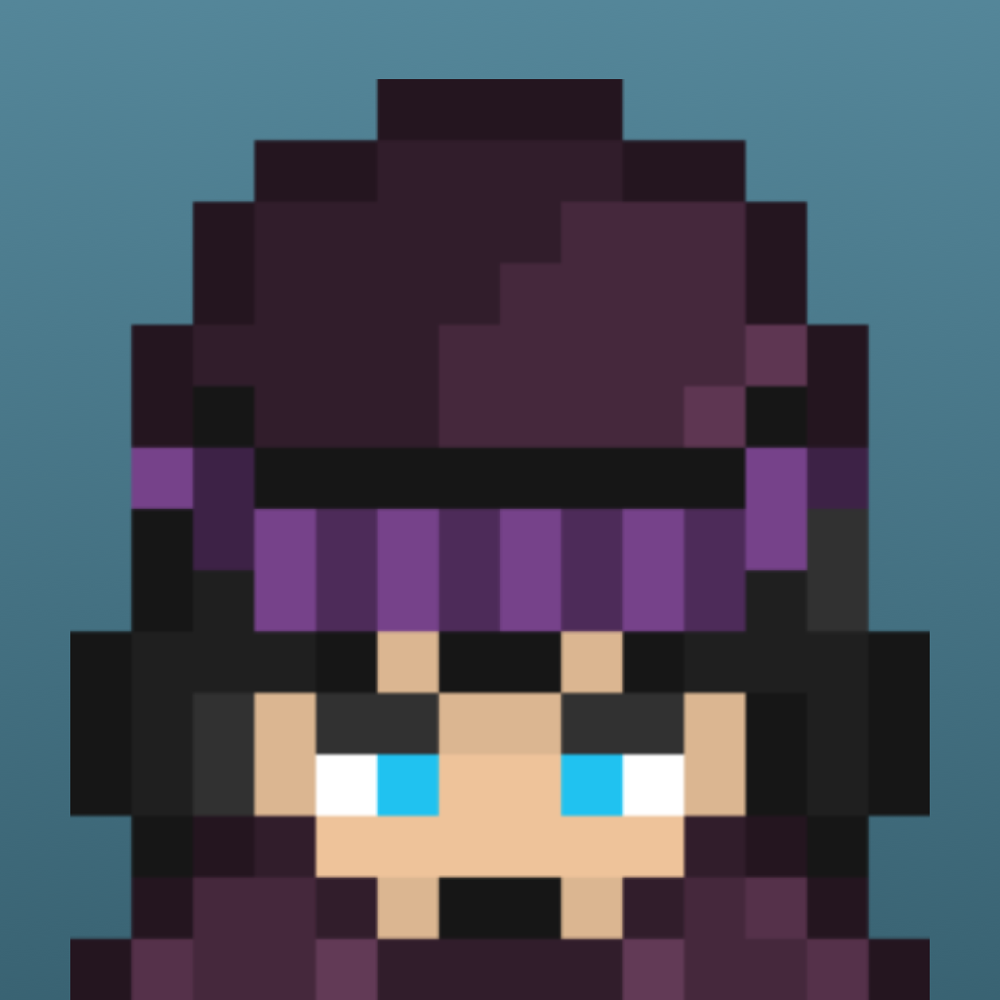

# UnveilPreludeProject
An RPG game storyline demo made with SpriteKit and GameplayKit. Optimized for iPhone 11.
* Frameworks: SpriteKit, GameplayKit.
* Dialogue System, Touch Controls, Scene Management, Level Design, Localization, Game State machine, Sound Design

 
 
 
 
 

